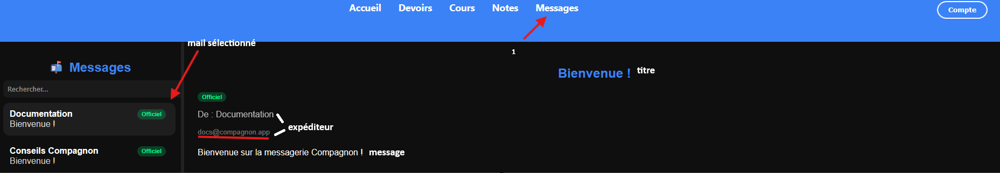

# Utilisation de la messagerie


#### Information

Compagnon ne dispose actuellement **pas** de moyen pour envoyer un message ; nous y travaillons.


#### Envoyer un message via la messagerie

Compagnon ne dispose présentement **pas** de moyen pour envoyer un message ; nous y travaillons activement.

#### Voir un message via la messagerie

<figure><figcaption>
Page de messagerie dans l'application web de Compagnon
</figcaption></figure>

#### Supprimer et déplacer un message


#### Information

Compagnon ne dispose actuellement **pas** de moyen pour supprimer ou déplacer un message ; nous y travaillons.

